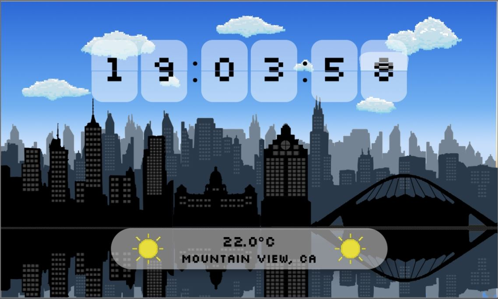

# Flutter Clock Competition Entry - Durban City, South Africa 

## Welcome to my Flutter Clock Competition Entry!

I decided to incorporate my home city into an animated pixel art background for my smart clock face. I used Rive (formerly called Flare) and animated and designed what you'll see before you. I pulled some commercially free bitmaps from reputable sources and constructed my own version of the cityscape using Adobe Photoshop and then ported it all over into Rive. 

This project was my first ever look at Flutter, Rive and Application Development as a whole, so whether I win or lose, I'm proud that I was able to get the job done with the little amount of time I had after working hours. It was a fun little project and I'm super keen to start learning more about it. Please excuse the mish-mosh code, as mentioned above, I'm really new to Flutter/Dart and did what I had to in order to understand and get things working.

I hope someone can enjoy the work I've put in =) 

## Backgrounds as the day progresses 

###### Please ignore the times shown during the animation as this was done on a debug build in order to demonstrate the transition

### Sunrise 

### Day 

### Sunset

### Night

License
----

Apache 2.0
